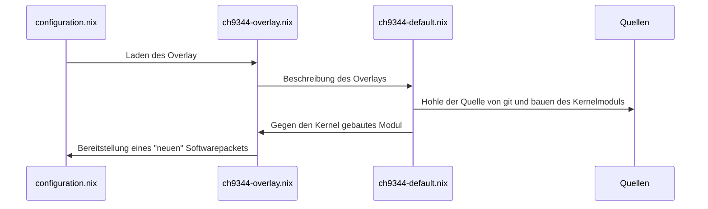

# nixos-ch9344

Dieses Repository dient als Beispiel wie das Kernel-Modul **ch9344** für ein NixOS System gebaut werden kann. Für den Einsatz sollte auf ein fertiges Module in [Nix-Packages](https://https://search.nixos.org/packages) zurückgegriffen werden.

## Files
configuration.nix -> ch9344-overlay.nix -> ch9344-default.nix -> [sources]



**configuration.nix** Beschreibt die Derivation des Systems in dem das Module eingebunden werden soll. *Default: /etc/nixos/configuration.nix*

**ch9344-overlay.nix** - Definiert die Bestandteile des Overlays

**ch9344-default.nix** - Beschreibt wie das Modul als Paket gebaut wird


### configuration.nix
```
# Modul laden

boot.extraModulePackages = with config.boot.kernelPackages; [
  ch9344
  ];

# Overlay einbinden

nixpkgs.overlays = [
    (import ./Pfad/zur/ch9344-overlay.nix)
  ];
```
### ch9344-overlay.nix
```

final: prev: {
  linuxPackages = prev.linuxPackages.extend (lfinal: lpref: {
    ch9344 = final.linuxPackages.callPackage ./Pfad/zur/ch9344-default.nix {};
    }
  );
}

```
### ch9344-default.nix
```

{ stdenv, lib, fetchFromGitHub, kernel, kernelModuleMakeFlags, kmod }:

  #Packetversion 
  stdenv.mkDerivation rec {
    pname = "ch9344";
    version = "1.0";

  # Herkunft der Quelle - ist auf rev gepinnt
  src = fetchFromGitHub {
    owner = "WCHSoftGroup";
    repo = "ch9344ser_linux";
    rev = "4e7a4890ada6d6db3fde50beb1c7f7ec21b68816";
    hash = "sha256-c0bahEqZeWpXtKW3wxRwjoo1PA+Sljyx2xgaKaHz9QM=";
  };

  kernelVersion = kernel.modDirVersion;

  sourceRoot = "source/driver";
  hardeningDisable = [ "pic" "format" ];                                             # 1
  nativeBuildInputs = kernel.moduleBuildDependencies;                       # 2

  preBuild = "ls ";
  makeFlags = kernelModuleMakeFlags ++ [
    #"KERNELRELEASE=${kernel.modDirVersion}"                                 # 3
    "KERNELDIR=${kernel.dev}/lib/modules/${kernel.modDirVersion}/build"    # 4
    "INSTALL_MOD_PATH=$(out)"                                               # 5
  ];

  installPhase = ''
    mkdir -p $out/lib/modules/$kernelVersion/kernel/drivers/usb/serial/
    cp -f ./ch9344.ko $out/lib/modules/$kernelVersion/kernel/drivers/usb/serial/
  '';

  # Schlechtes Beispiel, da nicht gut ausgearbeitet
  meta = {
    description = "A kernel module supports USB to quad serial ports chip ch9344 and USB to octal serial ports chip ch348";
    homepage = "https://github.com/WCHSoftGroup/ch9344ser_linux";
    license = lib.licenses.gpl2Plus;
   # maintainers = [ lib.maintainers.derkaktus ];
    platforms = lib.platforms.linux;
  };
}

```
