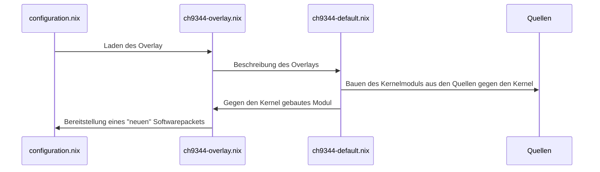

# nixos-ch9344

Dieses Repository dient als Beispiel wie das Kernel-Modul **ch9344** für ein NixOS System gebaut werden kann. Für den Einsatz sollte auf ein fertiges Module in [Nix-Packages](https://https://search.nixos.org/packages) zurückgegriffen werden.

## Files
configuration.nix -> ch9344-overlay.nix -> ch9344-default.nix -> [sources]

**configuration.nix** Beschreibt die Derivation des Systems in dem das Module eingebunden werden soll. *Default: /etc/nixos/configuration.nix*

**ch9344-overlay.nix** - Definiert die Bestandteile des Overlays

**ch9344-default.nix** - Beschreibt wie das Modul als Paket gebaut wird

